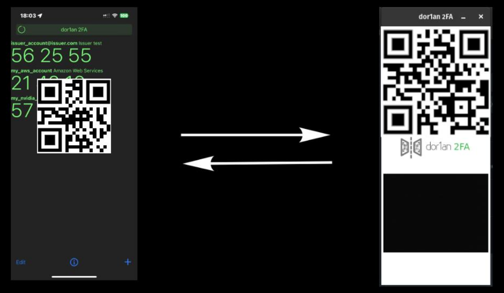
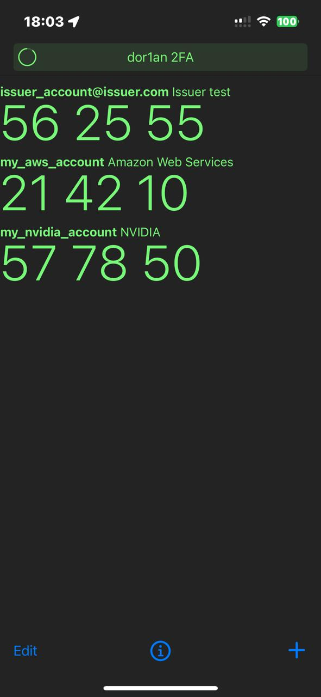
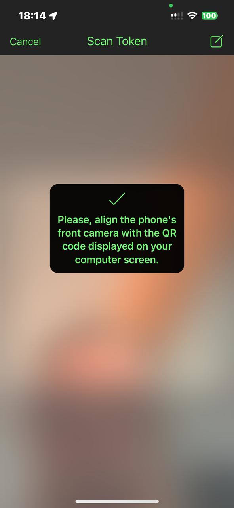
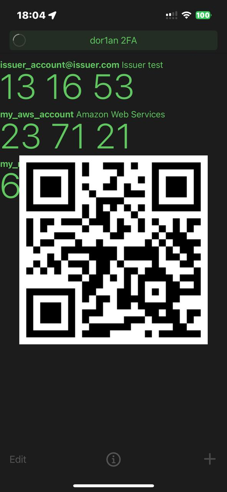

# dor1an2FA
### Two-Factor Authentication application.

dor1an2FA is a free, open-source [two-factor authentication](https://en.wikipedia.org/wiki/Two-factor_authentication) app designed for simplicity. It uses innovative screen-to-camera communication to automagically autofill the 6-digit [TOTP](https://en.wikipedia.org/wiki/Time-based_one-time_password) token required as the second factor for secure web application logins.

*dor1an2FA is an open source part of the dor1an project (https://dor1an.com), a USPTO patent-pending initiative of a secrets management suite designed to facilitate secure and efficient management of sensitive information, such as tokens and passwords.*

It has two components: a mobile Authenticator-like application combined with a browser extension in order to talk each other via screen-camera communication.

 

 &nbsp;
 &nbsp;
 &nbsp;

## Getting Started

*Note1: The application is currently under development and can only be installed manually from GitHub. Stay tuned for its release on the App Store and Google Play.*

*Note2: The application is currently developed for Apple phones (iOS) and Google Chrome web browser. Stay tuned for new releases on other platforms.*

## Usage

### Install

1. Follow the instructions in [dor1an2FA Chrome Extension](https://github.com/ch4r1i3b/dor1an2FA-chrome-extension).

2. Follow the instructions in [dor1an2FA iOS mobile app](https://github.com/ch4r1i3b/dor1an2FA-ios).

### Setup

2. In dor1an2FA mobile app, add 2FA authentication of your 2FA requesting (main screen, **+** button)

    a. Scan the QR code of the 2FA requesting site, or

    b. Add the parameters manually.

3. Edit the token you added (main screen, **Edit** button) and add the hostname of the 2FA requesing site (i.e.: signin.aws.amazon.com).

### Authenticate

4. Navigate to the login page of the site where you need to authenticate using the second factor.

5. Enter you username and password as allways.

6. When you reach the page that is requesting for the second factor, the browser will pop up the extension window showing a QR (with the coded hostname) and starting the laptop camera.

7. Open dor1an2FA on your phone, and click on the token of that site.

8. Align the phone's front camera with the QR code displayed on the laptop screen.

9. dor1an2FA will check if the hostname matches, if not it will pop an error message.

10. If they are the same, dor1an2FA mobile app screen will show another QR code, this time the qr-coded 6-digit of the password token.

11. The browser extension will scan the QR code, decode it to the 6-digit of the password token and enter it to the textbox of the site.

12. You are in!

## License

This project is made available under the terms of the [MIT License](https://opensource.org/licenses/MIT).

## Known Limitations

As of now, this project has the following limitations:

### Mobile Support

- Currently developed only for Apple iOS and can be installed via Xcode as a developer.  
- The code is in the process of being submitted to the Apple App Store.  
- An Android version is under development.  

### Browser Support

- Currently developed only for Google Chrome and can be installed manually as a developer.  
- The code is in the process of being submitted to the Chrome Web Store.  
- Extensions for other browsers are under development.  

### Website Support

In HTML, password fields are standardized as input elements of type `"password"`. However, for the 6-digit second factor, there is no standardization. The input element can be of any type (commonly `"text"` or `"password"`), and its ID or name attribute can vary significantly between implementations.

This lack of standardization makes it challenging to reliably identify fields for entering the 6-digit second factor on websites.

To address this, dor1an2FA employs a strategy to automatically detect input fields of type `"text"` or `"password"` and searches for IDs or names containing keywords such as `"mfa"`, `"otp"`, `"2fa"`, `"6-digit"`, and similar patterns.

As new variations or naming conventions are discovered, they will be analyzed and added to the detection criteria, ensuring improved compatibility with a wider range of websites.
